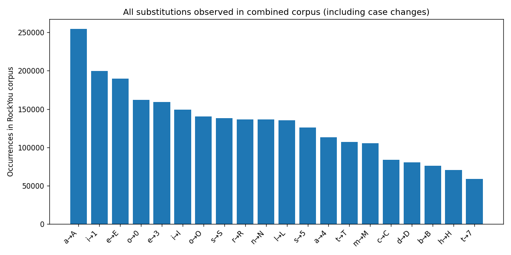
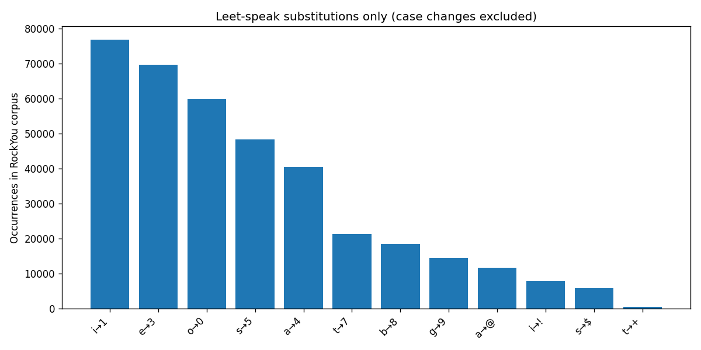

# tinymole

[](LICENSE)
[](https://www.openssl.org/)
[](flake.nix)
[](https://github.com/B-Ish-B/tinymole/commits/main)

**Multithreaded password cracker with tiny pointer hash tables and frequency-ranked candidate generation.**

Built in C++17. Uses a space-efficient hash table derived from [Bender et al. (ACM Transactions on Algorithms, 2024)](https://arxiv.org/abs/2111.12800) to pack more of the working set into cache, combined with lock-free multithreaded search and a frequency-ranked candidate list generated from RockYou. Final project for CSC 255-0C3: Objects and Algorithms, Oakton College, Spring 2026.

## Results

> Preliminary results on a 1M entry subset (Intel i3-1115G4, 2 physical cores / 4 threads, 6 MB L3). Full-dataset benchmarks will replace these once the complete RockYou run is complete.

### Hash table comparison (crack time, 1 thread vs 4 threads)

| Implementation | Slot size | 1 thread | 4 threads | Speedup |
|---|---|---|---|---|
| Tiny pointer (this project) | 24 bytes | 333 ms | 236 ms | 1.41x |
| Naive open-addressed | 32 bytes | 355 ms | 260 ms | 1.37x |
| std::unordered_map | ~100 bytes | 355 ms | 268 ms | 1.32x |

Tiny pointer is fastest at every thread count. The gap widens at 4 threads because smaller slots mean more of the working set fits in cache, reducing DRAM bandwidth pressure.

Full-dataset results and performance graphs will replace this section after the complete RockYou run. Benchmark methodology and raw data are in [docs/dev-benchmarks.md](docs/dev-benchmarks.md).

## Quick Start

No external data required. Clone, build, and crack a known hash in under two minutes:

```bash
git clone <repo>
cd tinymole
direnv allow
uv sync
make all
make test
./build/cracker --hash 5f4dcc3b5aa765d61d8327deb882cf99 --wordlist data/test_wordlist.txt
```

Expected output:

```
cracked: password
```

`make test` expected output:

```
[  PASSED  ] 10 tests.   # tiny_ptr and hash_table
[  PASSED  ] 13 tests.   # hash_table large insert/lookup
[  PASSED  ] 9 tests.    # hash_table_naive
[  PASSED  ] 8 tests.    # hash_table_stdmap
[  PASSED  ] 11 tests.   # cracker integration and partition
```

Full logs are written to `logs/cracker.log` on every run.

## Setup

### Linux and macOS

One-time machine setup:

```bash
echo "experimental-features = nix-command flakes" >> ~/.config/nix/nix.conf

eval "$(direnv hook bash)"   # or zsh
```

First-time setup after cloning:

```bash
git clone <repo>
cd tinymole
direnv allow
uv sync
make all
make test
```

After the one-time `direnv allow`, every subsequent `cd` into the project directory activates the environment automatically.

### Windows

Nix does not run natively on Windows. You need WSL2 with a Linux distribution (Ubuntu 22.04 or later is recommended).

One-time WSL2 setup (run in PowerShell as Administrator):

```powershell
wsl --install
```

Restart your machine, then open your WSL2 terminal and install Nix:

```bash
sh <(curl -L https://nixos.org/nix/install) --daemon
```

Close and reopen the terminal, then install direnv:

```bash
echo "experimental-features = nix-command flakes" >> ~/.config/nix/nix.conf
nix profile install nixpkgs#direnv
eval "$(direnv hook bash)"
```

From this point the setup is identical to Linux. Clone the repo inside your WSL2 home directory (not under `/mnt/c/`) and run the first-time setup steps above. All subsequent work should be done from within WSL2.

## Pipeline

The project runs in three sequential steps. The frequency analysis runs once to produce a ranked candidate list. The cracker binary loads the wordlist into a hash table at startup, then iterates through candidates in ranked order until a match is found.

<!-- Architecture diagram showing the three-component pipeline will be added here. -->

### Step 1: Obtain rockyou.txt

The wordlist is not included in the repo. Place it at `data/rockyou.txt` before continuing:

```bash
# Kali or Parrot (already on disk)
cp /usr/share/wordlists/rockyou.txt data/rockyou.txt
# or if gzipped
gunzip -c /usr/share/wordlists/rockyou.txt.gz > data/rockyou.txt
```

For all other systems, download the RockYou dataset from a reputable security research source and place it at `data/rockyou.txt`.

### Step 2: Run frequency analysis

```bash
uv run src/python/frequency_analysis.py
```

This reads `data/rockyou.txt` and produces:

| Output | Path |
|---|---|
| Frequency-ranked candidate list | `data/candidates_ranked.txt` |
| Substitution pattern frequencies | `data/substitution_rules.json` |
| All-substitutions chart | `results/substitution_analysis_all.png` |
| Leet-speak chart (case changes excluded) | `results/substitution_analysis_leet.png` |

Expected terminal output:

```
Loading rockyou.txt
14,344,391 unique passwords (14,344,391 total entries)
Analyzing substitution patterns
26 base chars with substitutions -> data/substitution_rules.json
Top substitutions:
a -> A  (159,829x)
e -> E  (124,043x)
i -> 1  (76,582x)
...
Wrote data/candidates_ranked.txt
```

### Substitution frequency charts (1M subset)





For a faster test run on a subset:

```bash
uv run src/python/frequency_analysis.py --limit 1000000 --top 10000
```

### Step 3: Build and run the cracker

```bash
make all
./build/cracker --hash 5f4dcc3b5aa765d61d8327deb882cf99 --wordlist data/rockyou.txt --candidates data/candidates_ranked.txt --threads 4
```

`--wordlist` builds the hash lookup table. `--candidates` sets the iteration order. Passing both means the full RockYou table is searched but the most statistically likely passwords are tried first. See the Usage section below for all available flags.

Expected terminal output:

```
cracked: password
```

Full structured logs including table build stats, thread count, and crack timing are written to `logs/cracker.log`.

## Usage

```
./build/cracker --hash <hex> [options]

options:
  --hash       <hex>   hex-encoded hash to crack (required)
  --algo       <name>  hash algorithm: md5, sha1, sha256 (default: md5)
  --wordlist   <path>  wordlist file, one password per line
                       (default: data/rockyou_1m.txt)
  --candidates <path>  frequency-ranked candidate list
                       (defaults to wordlist if not provided)
  --threads    <n>     number of worker threads (default: 4)
  --log-path   <path>  log file path (default: logs/cracker.log)
```

The `--hash` value must be the correct hex length for the chosen algorithm:
32 chars for MD5, 40 for SHA-1, 64 for SHA-256. The cracker validates this
at startup and exits with an error if the lengths do not match.

Example:

```bash
# crack an MD5 hash
./build/cracker --hash 5f4dcc3b5aa765d61d8327deb882cf99 --threads 4

# crack a SHA-256 hash
./build/cracker \
  --hash 5e884898da28047151d0e56f8dc6292773603d0d6aabbdd62a11ef721d1542d8 \
  --algo sha256 \
  --threads 4
```

Note: bcrypt requires a separate verification path and is not supported
via `--algo`. bcrypt hashes embed a salt and cost factor and cannot be
cracked with a simple hash comparison loop.

## Terminal UI

An interactive terminal UI is available as an alternative to the CLI:

```bash
make tui
```

On launch it displays the tinymole ASCII banner. Press any key to enter the main interface, which has a configuration form on the left and a live log panel on the right that tails `logs/cracker.log` as the cracker runs. The status bar at the bottom shows the result when the run completes.

Requires the cracker binary to be built first (`make all`). The TUI is implemented in `src/python/tui.py` using [Textual](https://github.com/Textualize/textual).

## Makefile Targets

| Target | Purpose | Flags |
|---|---|---|
| `make all` | Default release build, used for all benchmarks | `CXXFLAGS_RELEASE` |
| `make debug` | Development build with address + undefined sanitizers | `CXXFLAGS_DEBUG` |
| `make tsan` | Thread sanitizer build, run before any multithreaded benchmark | `CXXFLAGS_TSAN` |
| `make test` | Build and run all Google Test unit tests | `CXXFLAGS_DEBUG` |
| `make bench` | Build and run Google Benchmark microbenchmarks | `CXXFLAGS_RELEASE` |
| `make crack HASH=<hex>` | Build cracker, run frequency analysis if needed, then crack | `HASH`, `ALGO`, `THREADS`, `WORDLIST` |
| `make tui` | Launch the interactive terminal UI | n/a |
| `make lookup HASH=<hex>` | Query weakpass API for a hash before local cracking | `HASH`, `ALGO` |
| `make clean` | Remove all build artifacts | n/a |
