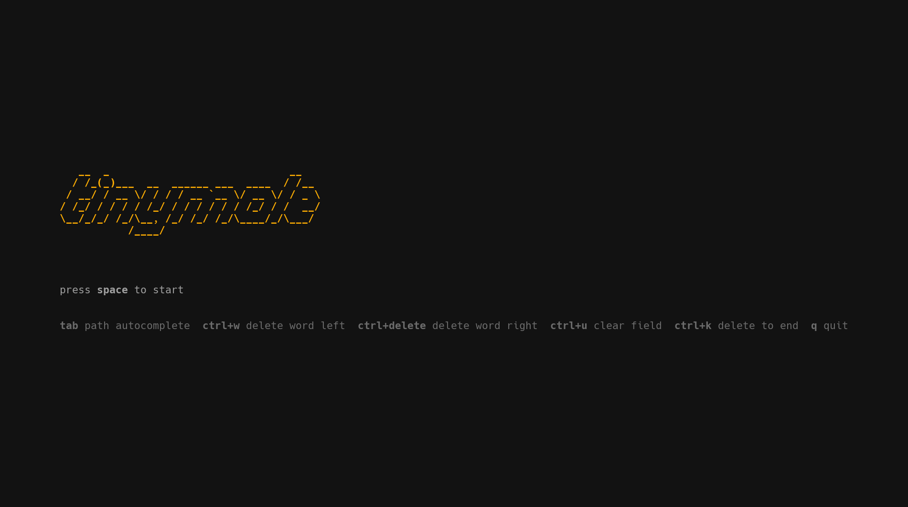
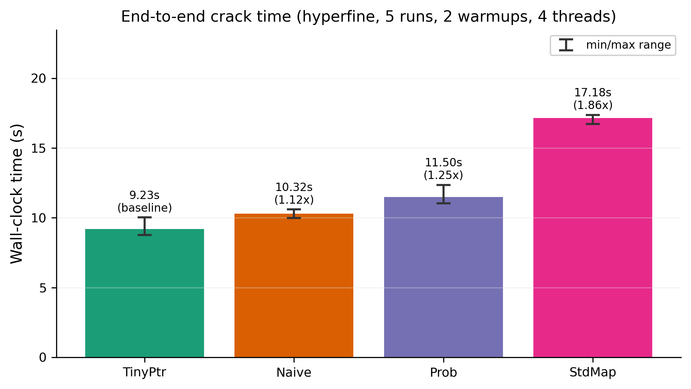
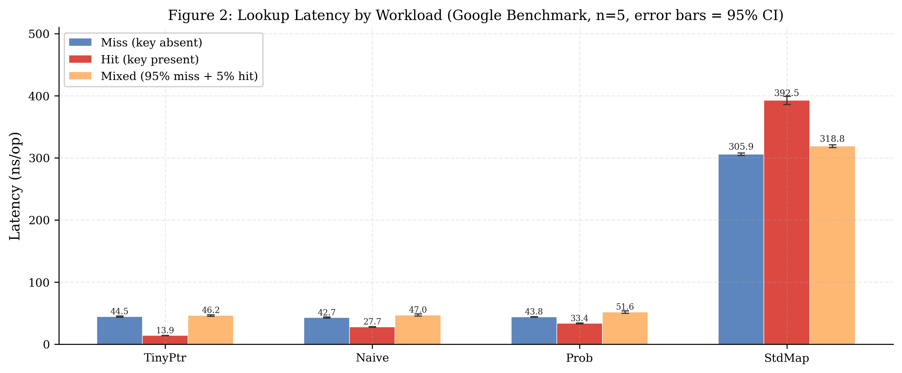

# tinymole

[](LICENSE)
[](https://www.openssl.org/)
[](flake.nix)
[](https://github.com/B-Ish-B/tinymole/commits/main)

Multithreaded dictionary password cracker with four hash table implementations, benchmarked against the full 14.3 million entry RockYou wordlist. Built around a bit-packed pointer design derived from [Bender et al. (ACM ToA, 2024)](https://doi.org/10.1145/3700594).



```bash
make tui
```

---

## Results

Benchmarked on an Intel i3-1115G4 (Tiger Lake, 2 cores / 4 threads, 4.1 GHz boost, 6 MB L3) against all 14,344,391 RockYou entries. End-to-end times use 4 threads targeting a mid-list entry, mean of 5 hyperfine runs.

| Implementation | Pointer | Miss (ns) | Hit (ns) | End-to-end (4t) | Memory |
|---|---|---|---|---|---|
| TinyPtr (bit-packed) | 27-bit offset + 5-bit length | 44.5 | **13.9** | **9.2 s** | 680 MB |
| Naive (full offset) | 32-bit raw offset | **42.7** | 27.7 | 10.3 s | 680 MB |
| Prob (key-dependent) | 6-bit DEREFERENCE | 43.8 | 33.4 | 11.5 s | 1194 MB |
| std::unordered_map | 64-bit heap pointer | 305.9 | 392.5 | 17.2 s | 1912 MB |

- All three custom tables beat `std::unordered_map` by **6.9x** on miss latency and **1.86x** end-to-end.
- TinyPtr achieves **2.0x faster hit lookups** than Naive by encoding password length in the pointer, eliminating one dependent pool read.
- With perf counters scoped to the lookup loop alone, all three custom designs hit the same **~5.3 LLC misses per lookup**; StdMap doubles that at 10.9 due to pointer chasing.
- Probabilistic 6-bit pointers are 1.25x slower end-to-end because their DEREFERENCE-based hit path is **2.4x slower** than TinyPtr's (33.4 vs 13.9 ns), not because of miss-phase cache pressure.





Throughput saturates around 3.6-4.1 MH/s at 4 threads, which fully populates the 2 cores × 2 hyperthreads of the test machine (memory-bandwidth bound, not CPU bound). Full analysis in [docs/write_up.md](docs/write_up.md).

---

## Quick Start

```bash
git clone <repo> && cd tinymole
direnv allow && uv sync
make all && make test
./build/cracker --hash 5f4dcc3b5aa765d61d8327deb882cf99 --wordlist data/test_wordlist.txt
# cracked: password
```

To crack against the full RockYou table, place `rockyou.txt` at `data/rockyou.txt`, then:

```bash
make crack HASH=<hex>
```

---

## Setup

### Linux and macOS

```bash
echo "experimental-features = nix-command flakes" >> ~/.config/nix/nix.conf
eval "$(direnv hook bash)"   # or zsh

# after cloning
direnv allow && uv sync
make all && make test
```

### Windows (WSL2)

```powershell
wsl --install   # PowerShell, Administrator
```

Inside WSL2:

```bash
sh <(curl -L https://nixos.org/nix/install) --daemon
echo "experimental-features = nix-command flakes" >> ~/.config/nix/nix.conf
nix profile install nixpkgs#direnv && eval "$(direnv hook bash)"
```

Clone inside the WSL2 home directory (not `/mnt/c/`) and follow the Linux steps above.

---

## Usage

```
./build/cracker --hash <hex> [options]

  --hash       <hex>   target hash (required)
  --algo       <name>  md5 | sha1 | sha256  (default: md5)
  --wordlist   <path>  wordlist for the lookup table  (default: data/rockyou.txt)
  --candidates <path>  ranked candidate order  (defaults to wordlist)
  --threads    <n>     worker threads  (default: 4)
  --log-path   <path>  log file  (default: logs/cracker.log)
```

Run frequency analysis once to build a ranked candidate list:

```bash
uv run src/python/frequency_analysis.py
make crack HASH=<hex>   # uses candidates_ranked.txt automatically
```

---

## Makefile Targets

| Target | What it does |
|---|---|
| `make all` | Release build (`-O2 -march=native`) |
| `make test` | Build and run all unit tests |
| `make bench` | Google Benchmark throughput (miss/hit/mixed, 5 reps) |
| `make latency` | RDTSC latency percentiles, 2M samples |
| `make hyperfine` | End-to-end wall-clock timing, 5 runs |
| `make crack HASH=<hex>` | Build and run the cracker |
| `make tui` | Launch the terminal UI |
| `make debug` / `make tsan` | Sanitizer builds |
| `make clean` | Remove build artifacts |

Regenerate all figures after running benchmarks:

```bash
make bench && make latency && make hyperfine
uv run python3 results/plot_benchmarks.py
```

---

## Tests

```bash
make test        # C++ (Google Test)
uv run pytest -v # Python
```

Expected C++ output:

```
[  PASSED  ] 10 tests.   # tiny_ptr and PasswordPool
[  PASSED  ] 13 tests.   # HashTable
[  PASSED  ] 9 tests.    # HashTableNaive
[  PASSED  ] 8 tests.    # HashTableStdMap
[  PASSED  ] 11 tests.   # HashTableProb
[  PASSED  ] 11 tests.   # cracker integration
```

---

## References

Bender, M. A., Conway, A., Farach-Colton, M., Kuszmaul, W., and Tagliavini, G. (2024). Tiny Pointers. *ACM Transactions on Algorithms*, 21(4), Article 38, 1-43. https://doi.org/10.1145/3700594
