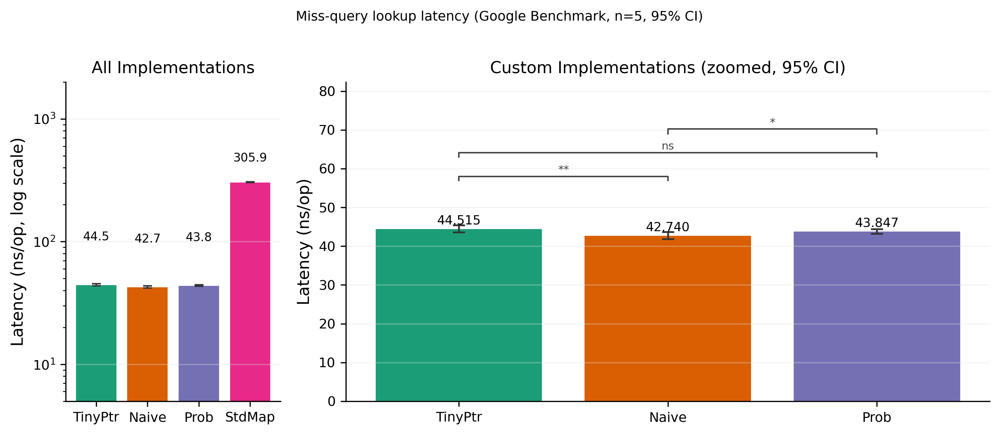
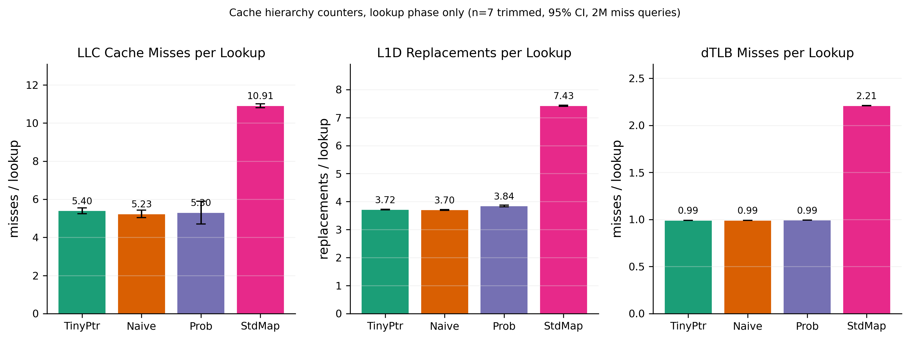
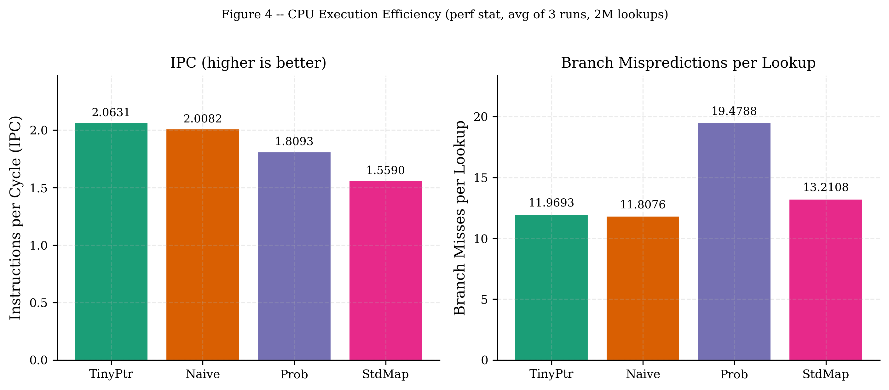
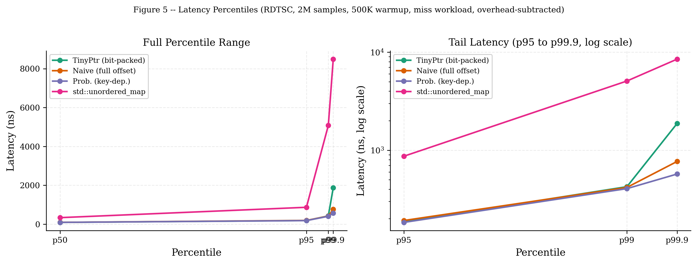
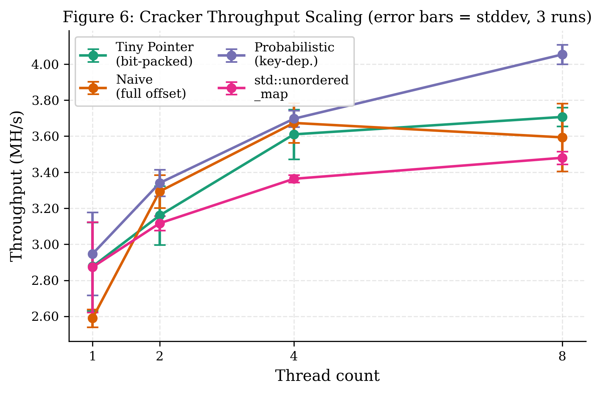
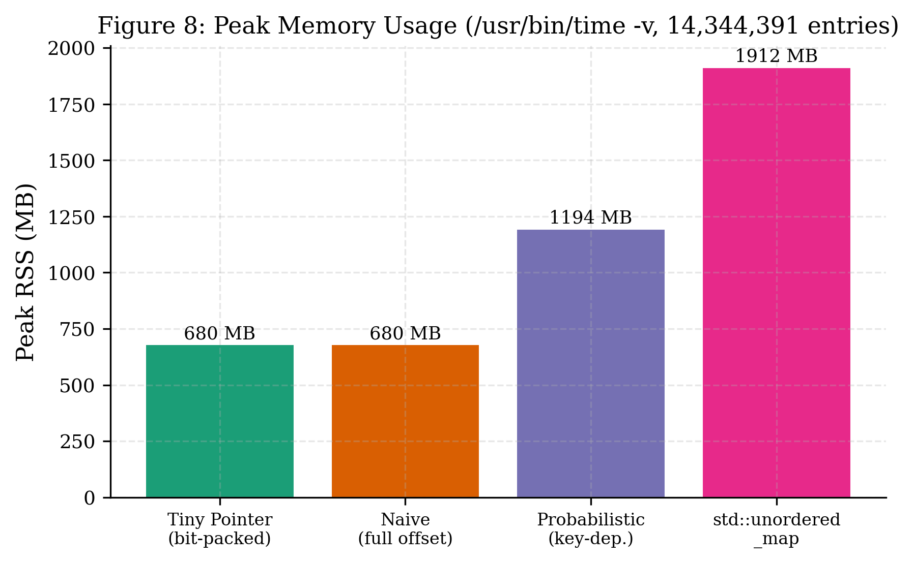

# tinymole: A Comparative Study of Compact Hash Table Designs for Password Cracking

**Author:** Ismail Alwahsh
**Date:** May 2026

---

## Abstract

tinymole is a multithreaded dictionary-based password cracker that serves as a platform for comparing four hash table designs under a realistic cracking workload. The central design question is whether reducing per-entry pointer width (as formalized by Bender et al. in their Tiny Pointers paper, ACM Transactions on Algorithms, 2024) translates into measurable performance gains when the lookup table holds 14.3 million MD5 hashes. We implement three custom tables (bit-packed offset, naive full-offset, and probabilistic key-dependent) alongside a `std::unordered_map` baseline, benchmark them across miss, hit, and mixed workloads, and measure end-to-end crack time with hyperfine. The bit-packed implementation achieves 2.0x faster hit lookups than the naive baseline (13.9 ns vs 27.7 ns), all three custom designs outperform `std::unordered_map` by 6.9x on miss queries (43-45 ns vs 306 ns), and the best custom design completes the end-to-end crack 1.86x faster than the `std::unordered_map` baseline. Scoping hardware counters to the lookup loop alone shows that all three custom designs share the same per-lookup miss-path cache behavior (~5.3 LLC misses per lookup) while StdMap takes a 2x penalty from pointer chasing. Decomposing end-to-end wall time shows that the differences between custom designs come almost entirely from table-construction cost: the probabilistic implementation is 1.25x slower end-to-end because its two-level allocator and 1.76x larger pool take ~2.4 s longer to populate, not because its per-lookup latency is meaningfully different from TinyPtr's during the cracker's parallel scan.

---

## 1. Introduction

Dictionary attacks are the dominant technique for recovering plaintext passwords from leaked hash databases. The attacker loads a large wordlist, computes the hash of each candidate, and checks whether it matches any target. At scale the bottleneck is rarely hashing speed (modern x86 cores compute MD5 at roughly 500-700 MB/s per core with OpenSSL's hand-tuned assembly, so a typical 8-character password hashes in well under 200 ns) but rather the lookup that follows: the candidate hash must be tested against a table that, for a 14 million entry wordlist, occupies several hundred megabytes of RAM. When the table does not fit in L3 cache, each lookup incurs a main-memory access, and per-lookup latency climbs from single-digit nanoseconds to hundreds of nanoseconds.

Tiny pointers, introduced by Bender, Conway, Farach-Colton, Kuszmaul, and Tagliavini (2024), address this class of problem by observing that the pointer stored in each hash table slot need not encode the full pool offset unambiguously in isolation. If both the key and the pointer are used together at lookup time (a DEREFERENCE(key, ptr) operation), the key's many bits can resolve most of the ambiguity, leaving the pointer to carry only a logarithmically small residual. The theoretical result is that Θ(log log log n + log k) bits suffice at load factor 1 - 1/k, versus 27 bits for a naive 128 MB pool at the same capacity. The log k term captures the space-time tradeoff: tighter load factors require wider pointers.

This project implements four hash table variants on top of a shared cracker core and measures their performance across microbenchmarks (Google Benchmark, RDTSC), hardware counter profiling (perf stat), thread-scaling experiments, and end-to-end wall-clock timing (hyperfine). The implementations span the design space from a faithful bit-packed pointer format through a simplified probabilistic DEREFERENCE construction to the standard library baseline. All experiments use the full RockYou wordlist (14,344,391 entries) and a mid-list target that forces each run to scan roughly half the wordlist before finding a match.

---

## 2. Background

### 2.1 Dictionary-Based Password Cracking

A dictionary attack has two phases: build-time and query-time. During build-time the cracker hashes every word in the candidate list and stores each (hash, plaintext-pointer) pair in a lookup structure. During query-time, for each target hash, the cracker performs a single lookup and, on a hit, returns the stored plaintext. In the conventional "many targets, one wordlist" attack pattern, most candidates fail to match any target, so the miss path dominates total runtime; a typical workload of that kind is roughly 95% misses and 5% hits, which we model with the Mixed microbenchmark in §6.2. The tinymole cracker itself runs the inverse pattern for benchmarking purposes: a single target hash is sought by iterating the wordlist against a table also built from the wordlist, so every lookup in its end-to-end runs is a hit. This makes hit-path latency the dominant per-lookup cost in §6.7's wall-time measurements, while §6.1's miss microbenchmark and §6.3's cache counters characterize the lookup structure's miss path in isolation.

The candidate list need not be presented in wordlist order. A frequency-analysis pipeline ranks candidates by statistical likelihood using character substitution frequencies extracted from the wordlist itself, so the cracker tries the most probable passwords first. This reduces expected scan depth and improves crack time on soft targets, but does not change the per-lookup cost.

### 2.2 Tiny Pointers

Bender et al. (2024) define a tiny pointer as a compressed pointer that uses the key to resolve ambiguity at dereference time. Formally, an allocation scheme is given a universe of n items and a pool; ALLOCATE(v) places v in the pool and returns a tiny pointer p; DEREFERENCE(k, p) recovers v using both the key k and the pointer p. The key insight is that at the time of lookup the key is known and carries lg n bits of information, so the pointer only needs to encode the remaining Θ(log log log n + log k) bits of position within a small local neighborhood, where k controls the load factor (1 - 1/k). At n = 14 million and our realized load factor of ~0.43 (k ≈ 1.75), the bound evaluates to approximately 3 bits, versus lg n ≈ 24 bits for a fully explicit pointer: a theoretical compression of roughly 8x.

The paper proves that a two-choice allocation scheme with bucket sizes that grow with k achieves this bound with high probability. Our probabilistic implementation uses a simplified version of this construction with 6-bit pointers and buckets of size 16.

---

## 3. System Design

### 3.1 Hash Table Abstraction

All four implementations satisfy a common interface: `load(ifstream, pool)` populates the table from a wordlist file, and `lookup(hash, pool_base)` returns a `std::string_view` of the matching plaintext or an empty view on miss. The cracker core is templated on table type so the same worker loop runs against every implementation without duplication.

Each implementation hashes passwords with MD5 using OpenSSL's EVP interface and stores a 96-bit truncated digest as the key in each slot. Truncation reduces slot size without meaningfully affecting collision probability: for n = 14.3 million entries, the birthday-bound collision probability is n^2 / 2^96, approximately 2.5 x 10^-15, which is negligible.

### 3.2 Memory Pool

The bit-packed and naive implementations share a `PasswordPool` abstraction: a flat `std::vector<char>` into which password strings are appended sequentially with a null terminator. The pool supports at most 128 MB of aggregate data (the 27-bit offset field constraint) and passwords of at most 31 characters (the 5-bit length field constraint). The probabilistic implementation uses a separate fixed-slot pool with 32-byte entries (1 byte length + 31 bytes data), which guarantees O(1) slot access at the cost of wasted space for short passwords.

### 3.3 Threading Model

Worker threads are launched with `std::thread` and receive disjoint slices of the candidate list partitioned round-robin. Each thread iterates its slice independently, hashing each candidate with MD5 and calling `lookup` on the shared (read-only) hash table. A shared `std::atomic<bool> found` flag signals all threads to exit once a match is discovered. A separate `std::atomic<size_t> hashes_done` counter is incremented per-lookup so that MH/s reporting reflects actual work performed rather than total candidate count, which would overstate throughput on early exits.

### 3.4 Frequency Analysis

A Python pipeline processes the raw wordlist, extracts character-level substitution patterns (a -> @, e -> 3, etc.), and scores each candidate by the product of its base-word frequency and the cumulative probability of any substitutions applied. The output is `data/candidates_ranked.txt`, which is used as the iteration order during cracking. This ranking substantially improves crack time on passwords with common substitution patterns but does not affect benchmark comparisons since all implementations use the same candidate ordering.

---

## 4. Implementations

### 4.1 TinyPtr (Bit-Packed Offset and Length)

Each slot is 16 bytes: 12 bytes of truncated MD5 key and a 32-bit `tiny_ptr` field. The `tiny_ptr` packs a 27-bit pool byte offset and a 5-bit password length into a single word:

```
tiny_ptr = (offset << 5) | (length & 0x1F)
```

Both the offset and the length are available immediately after reading the slot, with no additional memory access required. On a hit, `lookup` extracts both fields with two shift-and-mask operations and constructs a `std::string_view(pool_base + offset, length)` without dereferencing the pool. This is the structural reason for TinyPtr's faster hit path in the microbenchmark, which times construction only (its `.size()` is read to defeat dead-code elimination). A client that subsequently reads the password contents would still pay a pool cache-line miss, so the 2x microbenchmark advantage erodes in workloads that consume the plaintext on every hit.

The 27-bit offset field supports pool sizes up to 128 MiB, sufficient for the full RockYou dataset (~133 MiB raw, but passwords over 31 characters are excluded, reducing pool usage). The `static_assert(sizeof(Slot) == 16)` enforces the layout at compile time.

### 4.2 Naive (Full 32-Bit Offset)

The naive implementation uses the same 16-byte slot layout (12 bytes of key and a 32-bit field) but stores a raw byte offset with no embedded length. On a hit, `lookup` reads `pool_base + offset` and scans forward for the null terminator to determine the string length. This O(|password|) scan requires touching pool memory that may not be in cache, adding one dependent memory access relative to TinyPtr on the hit path. The miss path is identical between the two implementations: both compare the 96-bit key and return an empty view without touching the pool.

### 4.3 Probabilistic (Key-Dependent DEREFERENCE)

The probabilistic implementation follows the DEREFERENCE(k, p) construction from Bender et al. Each 16-byte `ProbSlot` stores 12 bytes of key and a 6-bit tiny pointer in a single `uint8_t` (with 3 bytes of padding). The pointer encodes position within a two-level bucket scheme:

- Bits 0-3: slot index within a bucket of 16 (b = 16 from the paper).
- Bit 4: selects primary (85% of capacity) or secondary (15%) bucket pool.
- Bit 5: selects which of two secondary hash functions (h2 or h3) maps the key to the secondary bucket.

The allocator tries the primary bucket first (hash function h1), then falls back to two-choice allocation in the secondary pool using h2 and h3. At lookup time the key and pointer together determine the exact pool slot without storing a full offset; the 12-byte key field in the slot serves both as the equality check and as the disambiguation information required by the DEREFERENCE operation.

The pool uses 32-byte fixed-size entries to allow O(1) indexed access without a length scan. The sentinel value `0xFF` (bits 6-7 set) is reserved for empty slots; valid pointers set at most bits 0-5 and can never equal `0xFF`.

This implementation approximates the paper's construction at 6 bits per pointer rather than the theoretical minimum of approximately 3 bits at n = 14.3 million. A true 3-bit implementation would require the larger bucket sizes and tighter probabilistic analysis described in the paper and is left as future work.

### 4.4 std::unordered_map Baseline

The baseline wraps `std::unordered_map<std::array<uint8_t,16>, std::string>`, which uses separate chaining with heap-allocated nodes. Each entry incurs pointer overhead, hash metadata, and a heap allocation, yielding roughly 130-150 bytes per entry versus 16 bytes for the custom implementations. This establishes a lower bound on what a carefully designed open-addressed table should be able to achieve.

### 4.5 Complexity Summary

| Implementation | Slot Size | Pointer Bits | Lookup Miss | Lookup Hit | Pool Layout |
|---|---|---|---|---|---|
| TinyPtr | 16 B | 32 (27 offset + 5 length) | O(1) expected | O(1) | Variable-length |
| Naive | 16 B | 32 (raw offset) | O(1) expected | O(len) strlen | Variable-length |
| Prob | 16 B | 6 (key-dependent) | O(1) expected | O(1) | Fixed 32 B slots |
| std::unordered_map | ~140 B | 64 (heap pointer) | O(1) expected | O(1) | Heap per entry |

TinyPtr and Naive use simple linear probing across a single open-addressed table. Prob uses linear probing within a fixed-size bucket of 16 plus a two-choice fallback to a secondary bucket region when the primary bucket is full. For all three, the table is sized to a power of two large enough to keep the realized load factor below 0.7 (the resize threshold); for 14.3 million entries this rounds up to 2^25 = 33.5 million slots, giving a realized load factor of approximately 0.43. The theoretical minimum pointer width from Bender et al. at this scale and load factor is Θ(log log log n + log k), approximately 3 bits.

---

## 5. Experimental Setup

### 5.1 Hardware and Software

All benchmarks were run on a single workstation with an Intel Core i3-1115G4 (Tiger Lake, 2 physical cores with hyperthreading for 4 hardware threads) running at up to 4.1 GHz under the `performance` CPU frequency governor with Turbo Boost enabled. The cache hierarchy is 48 KiB L1d per core, 1280 KiB L2 per core, and 6144 KiB (6 MB) shared L3. The operating system is Linux 6.19.12 (Fedora 42). All binaries were compiled with GCC 15.2.0 at `-O2` targeting the generic x86-64 baseline (no `-march=native`, so no AVX2/AVX-512 codegen despite the host CPU supporting both). All four implementations are built under the same toolchain settings, so this affects absolute numbers but not relative comparisons. OpenSSL 3.6.1 provides MD5 via the EVP interface.

### 5.2 Dataset

The RockYou wordlist contains 14,344,391 entries totaling approximately 133 MiB (140 MB decimal). Passwords longer than 31 characters or containing null bytes are skipped at load time, affecting 2,498 entries (0.017% of the wordlist). The mid-list benchmark target is the MD5 of "jimmyisno1", which appears at approximately entry 7 million, forcing all threads to scan roughly half the wordlist before finding a match.

### 5.3 Benchmark Methodology

Four benchmark types were used:

**Google Benchmark (throughput):** The binary `build/bench_lookup` runs 5 repetitions of each benchmark function. Three workloads are measured: miss (query hash guaranteed absent, generated as MD5 of "MISS_QUERY_i"), hit (query hash sampled from the loaded wordlist), and mixed (95 misses followed by 5 hits in a fixed cycle). Results are reported as mean, median, and coefficient of variation across repetitions.

**RDTSC latency distribution:** The binary `build/bench_latency` uses serialized RDTSC (lfence + rdtsc at start, rdtscp + lfence at end) to record per-lookup cycle counts for 2 million consecutive miss queries after 500,000 warmup lookups. RDTSC call overhead is measured as the minimum of 1,000 empty measurement windows and subtracted from each sample. Samples are sorted and percentiles extracted.

**Hardware counters (perf_event_open):** Each implementation's standalone lookup binary (e.g., `build/perf_tinyptr`) uses the `perf_event_open(2)` syscall to open seven counters (LLC cache misses, cache references, instructions, cycles, branch misses, dTLB load misses, and L1d replacements) and brackets them with `PERF_EVENT_IOC_ENABLE`/`PERF_EVENT_IOC_DISABLE` around the 2-million-lookup loop. This excludes the table-load and query-generation phases from the measurement, so the resulting per-lookup rates reflect the lookup path alone rather than amortized whole-program costs. Each binary is run 7 times; per-metric values are aggregated by dropping the highest and lowest run and taking the trimmed mean of the remaining 5, with 95% confidence intervals from a t-distribution.

**End-to-end wall time (hyperfine):** `build/bench_cracker` is run via hyperfine with 2 warmup runs, 5 timed runs, and 4 threads for each implementation, targeting the mid-list hash.

---

## 6. Results

### 6.1 Miss-Query Lookup Latency

Table 1 reports Google Benchmark mean latency for the miss workload. All three custom implementations cluster tightly at 43-45 ns while `std::unordered_map` averages 305.9 ns, a 6.9x gap. The differences among the custom implementations are small in absolute terms. A pairwise Welch t-test (Table 2) finds TinyPtr vs. Naive statistically significant (p = 0.0054, Cohen's d = 2.39), while TinyPtr vs. Prob is not significant (p = 0.14). Both effect sizes are dwarfed by the gap between any custom implementation and StdMap (p < 0.001, Cohen's d > 200).

The miss path is memory-bound: on a miss, all three custom implementations check the 12-byte key field in the probed slot and return immediately without touching the pool. The 7x latency gap versus StdMap has two compounding sources. First, its pointer-chased bucket structure requires two dependent cache-line loads (the bucket array, then the chained node) versus a single slot read for open-addressed tables; this is confirmed by Table 5's 2x LLC miss ratio. Second, StdMap's lookup path executes roughly 5.3x more instructions per query (Table 5 cycles imply ~337 vs ~64 instructions per lookup) reflecting longer dependency chains in the standard library's probing logic. The product of those two effects approximates the observed latency gap.

**Table 1: Miss-Query Lookup Latency (Google Benchmark, n=5 repetitions)**

| Implementation | Mean (ns) | Stddev (ns) | Median (ns) | 95% CI |
|---|---|---|---|---|
| TinyPtr | 44.515 | 0.750 | 44.389 | [43.586, 45.444] |
| Naive | 42.740 | 0.734 | 43.035 | [41.829, 43.651] |
| Prob | 43.847 | 0.488 | 43.766 | [43.241, 44.453] |
| std::unordered_map | 305.859 | 1.639 | 306.209 | [303.826, 307.892] |

**Table 2: Pairwise Statistical Significance, Miss Latency (Welch t-test, n=5; custom implementations only)**

All custom-vs-StdMap comparisons are trivially significant (p < 0.001, Cohen's d > 200) and are omitted.

| Pair | t-stat | p-value | Sig. | Cohen's d |
|---|---|---|---|---|
| TinyPtr vs. Naive | 3.782 | 0.0054 | ** | 2.392 |
| TinyPtr vs. Prob | 1.669 | 0.1398 | ns | 1.056 |
| Naive vs. Prob | -2.808 | 0.0264 | * | 1.776 |



### 6.2 Hit and Mixed Workloads

The hit workload reveals the largest differentiation among the custom implementations (Figure 2). TinyPtr averages 13.9 ns per lookup, which is 2.0x faster than Naive (27.7 ns) and 2.4x faster than Prob (33.4 ns). This speedup is structural: the TinyPtr 32-bit field encodes both the pool offset and the password length, so lookup can construct a `std::string_view` directly from the slot contents. Naive stores only a raw offset and must scan the pool for a null terminator, adding one dependent pool access. StdMap hit latency (392.5 ns) is worse than its miss latency due to the additional pointer dereference needed to read the stored string value.

The mixed workload (95% miss, 5% hit) averages 46.2, 47.0, 51.6, and 318.8 ns for TinyPtr, Naive, Prob, and StdMap respectively. The 5% hit component raises mixed latency above pure miss for all implementations. Prob's mixed latency (51.6 ns) is noticeably higher than TinyPtr's (46.2 ns), reflecting the additional pool-level indirection in its DEREFERENCE path.

**Table 3: Lookup Latency by Workload (mean ns/op, Google Benchmark, n=5)**

| Implementation | Miss | Hit | Mixed (95:5) |
|---|---|---|---|
| TinyPtr | 44.5 | 13.9 | 46.2 |
| Naive | 42.7 | 27.7 | 47.0 |
| Prob | 43.8 | 33.4 | 51.6 |
| std::unordered_map | 305.9 | 392.5 | 318.8 |


### 6.3 Cache Behavior

Table 5 reports hardware counters from seven runs of each perf binary, with counter measurement scoped to the lookup loop alone via `perf_event_open` (Figure 3). All three custom implementations show essentially identical cache pressure on the miss path: approximately 5.3 LLC misses per lookup and 3.7 L1d replacements per lookup. The 512 MB working set exceeds the 6 MB L3 by nearly two orders of magnitude, so every slot read is effectively cold, and hardware prefetchers contribute additional cache-line fills on top of the demand miss. The variable-length pool layout (TinyPtr, Naive) and the fixed-slot two-level pool (Prob) all incur the same fundamental per-lookup miss cost during the miss phase.

StdMap is uniformly about 2x worse on every cache metric: 10.91 LLC misses, 7.43 L1d replacements, and 2.21 dTLB misses per lookup. The doubling reflects its two dependent pointer dereferences per lookup (the bucket array and the chained node), each potentially cold, versus a single slot read for an open-addressed table.

**Table 5: Hardware Counters, Lookup Phase Only (perf_event_open, n=7 trimmed, 2M miss queries)**

| Implementation | LLC Misses / Lookup | L1D Repl. / Lookup | dTLB Misses / Lookup | IPC | LLC Miss Rate |
|---|---|---|---|---|---|
| TinyPtr | 5.40 | 3.72 | 0.99 | 0.418 | 86.9% |
| Naive | 5.23 | 3.70 | 0.99 | 0.397 | 87.4% |
| Prob | 5.30 | 3.84 | 0.99 | 0.350 | 87.9% |
| std::unordered_map | 10.91 | 7.43 | 2.21 | 0.357 | 90.7% |

The dTLB result mirrors the LLC numbers: all three custom designs touch one cache line in a contiguous 512 MB region and hit the same small set of TLB entries (about 1 miss per lookup), while StdMap scatters its working set across many more pages of separately-allocated heap nodes (2.21 misses per lookup, a 2.2x penalty).



### 6.4 CPU Execution Efficiency

The instructions-per-cycle (IPC) metric reflects how heavily memory stalls dominate the lookup loop. All four implementations achieve only 0.35-0.42 IPC, an order of magnitude below the theoretical peak (~4 IPC for modern Intel cores), confirming that lookup is memory-bound rather than compute-bound: most cycles are spent waiting on cache lines rather than retiring instructions. TinyPtr leads at 0.418, Naive at 0.397, Prob at 0.350, StdMap at 0.357. The Prob/StdMap deficit reflects extra dependency chains in their lookup paths (Prob's two-level bucket conditional, StdMap's pointer chase).

Branch mispredictions cluster near 0.89 per lookup for TinyPtr, Naive, and StdMap, dominated by the in-lookup conditionals (key-equality check, empty-slot sentinel check, probe-termination) whose outcomes depend on hash-distributed slot contents and are effectively unpredictable. Prob is marginally higher at 0.93, consistent with its extra primary-vs-secondary branch on each lookup; the absolute difference is small but consistent across the seven runs.



### 6.5 Tail Latency

Table 4 reports RDTSC percentile latency for the miss workload. At p50 all three custom implementations are indistinguishable (91-94 ns, elevated from the Google Benchmark throughput numbers because the `lfence`/`rdtscp` barriers around each sample prevent the CPU from overlapping consecutive lookups, eliminating the speculative parallelism that Google Benchmark's amortized timing implicitly captures). At p99 they remain close (405-425 ns). Past p99 the picture is noisier. TinyPtr and Naive use the same open-addressed table and probing logic, so their tail latency should track each other on the miss path; in fact their distributions are essentially identical from p50 through p99 (within 3%). Their p99.9 values diverge (TinyPtr 1873 ns vs Naive 768 ns) but their maxima reverse the order (TinyPtr 15793 ns vs Naive 40734 ns), and with a single 2-million-sample run the p99.9 estimate is based on only ~2000 samples in a heavy-tailed regime; the TinyPtr-vs-Naive divergence at that percentile is consistent with sampling noise rather than a structural difference. The robust finding is Prob's narrower tail: at p99.9 Prob is 572 ns, ~30% tighter than Naive and 70% tighter than TinyPtr, which reflects the two-level scheme's statistical bound on maximum bucket occupancy. StdMap's p99.9 latency is 8490 ns (14.8x higher than Prob's), driven by deep chained-bucket lists from hash collisions and the random page distribution of separately-allocated nodes.

**Table 4: RDTSC Percentile Latency, Miss Workload (ns, 2M samples, 500K warmup)**

| Implementation | Mean | Stddev | p50 | p95 | p99 | p99.9 | Max |
|---|---|---|---|---|---|---|---|
| TinyPtr | 116.3 | 131.8 | 91.5 | 186.3 | 424.5 | 1873.3 | 15793.2 |
| Naive | 114.7 | 122.4 | 93.7 | 191.8 | 417.3 | 767.9 | 40734.8 |
| Prob | 111.6 | 82.1 | 92.1 | 183.6 | 405.7 | 571.7 | 18117.9 |
| std::unordered_map | 425.9 | 736.0 | 335.7 | 868.3 | 5079.5 | 8490.3 | 45883.3 |



### 6.6 Thread Scaling

Figure 6 shows cracker throughput in MH/s as thread count increases from 1 to 4 (the test machine has 2 physical cores with 2 hyperthreads each, so 4 software threads exactly populates the hardware contexts; we omit a separate 8-thread measurement that would only software-oversubscribe). All implementations exhibit sub-linear scaling: TinyPtr goes from 2.88 MH/s at 1 thread to 3.61 MH/s at 4 threads, a 1.25x speedup. Adding threads increases parallelism but also raises the aggregate LLC miss rate as multiple threads contend for the shared 6 MB L3 cache, so the per-thread efficiency falls off well before the hardware contexts are filled.

At 4 threads all three custom implementations cluster tightly between 3.61 and 3.70 MH/s; StdMap trails at 3.36 MH/s. The headline result is that all four designs saturate near 3.4-3.7 MH/s once every hardware context is occupied, with the L3 cache (not the cores) as the binding constraint.

**Table 6: Cracker Throughput, Mean MH/s (stddev), 3 runs per cell**

| Implementation | 1 thread | 2 threads | 4 threads |
|---|---|---|---|
| TinyPtr | 2.88 +/- 0.29 | 3.16 +/- 0.20 | 3.61 +/- 0.17 |
| Naive | 2.59 +/- 0.06 | 3.29 +/- 0.11 | 3.67 +/- 0.13 |
| Prob | 2.95 +/- 0.27 | 3.34 +/- 0.09 | 3.70 +/- 0.06 |
| std::unordered_map | 2.87 +/- 0.28 | 3.12 +/- 0.05 | 3.36 +/- 0.03 |



### 6.7 End-to-End Crack Time

Table 8 reports hyperfine wall-clock timing for a 4-thread crack of the mid-list target. TinyPtr completes in 9.226 s (mean, +/- 0.518 s), the fastest of the four. Naive takes 10.317 s (1.12x), Prob 11.501 s (1.25x), and StdMap 17.177 s (1.86x).

Subtracting the bench_cracker lookup-only timing (Table 6, mean of 3 runs at 4 threads) from the hyperfine end-to-end times isolates the table-construction cost (Table 7). All four implementations finish the lookup phase in essentially the same wall time (2.0-2.1 s; Prob is slightly faster due to its higher 4-thread MH/s). The end-to-end gaps map almost one-to-one onto load-time differences: Prob's two-level allocator (primary buckets plus two-choice secondary placement) and 1.76x larger pool take 2.4 s longer to populate, and StdMap's 14.3 million per-entry heap allocations add nearly 8 s. The structural advantage of the bit-packed TinyPtr design on this workload therefore shows up in build-time throughput, not in per-lookup speed during the parallel scan.

**Table 7: Load vs Lookup Decomposition (derived from Tables 6 and 8)**

| Implementation | Lookup phase | End-to-end | Table load (e2e - lookup) | Δ load vs TinyPtr |
|---|---|---|---|---|
| TinyPtr | 2.03 s | 9.23 s | 7.20 s | baseline |
| Naive | 2.03 s | 10.32 s | 8.29 s | +1.09 s |
| Prob | 1.88 s | 11.50 s | 9.62 s | +2.43 s |
| std::unordered_map | 2.07 s | 17.18 s | 15.11 s | +7.92 s |

**Table 8: End-to-End Wall Time (hyperfine, 5 runs, 2 warmups, 4 threads)**

| Implementation | Mean (s) | Stddev (s) | Min (s) | Max (s) | vs. TinyPtr |
|---|---|---|---|---|---|
| TinyPtr | 9.226 | 0.518 | 8.771 | 10.021 | 1.00x |
| Naive | 10.317 | 0.266 | 9.983 | 10.596 | 1.12x |
| Prob | 11.501 | 0.521 | 11.038 | 12.355 | 1.25x |
| std::unordered_map | 17.177 | 0.272 | 16.715 | 17.375 | 1.86x |


### 6.8 Memory Usage

Figure 8 shows peak RSS measured with `/usr/bin/time -v`. TinyPtr and Naive are essentially identical at 679.6 MB each, confirming that the pointer encoding does not affect overall footprint when both implementations use the same variable-length pool. The hash table itself accounts for roughly 512 MB (2^25 = 33.5 million 16-byte slots) and the variable-length pool plus program overhead account for the remaining 168 MB.

Prob uses 1,193.8 MB (1.76x TinyPtr). The increase comes from two sources: the fixed 32-byte pool slots consume roughly 3x more space per entry than the average variable-length entry (RockYou's mean password length is 8.7 characters, so a typical TinyPtr pool entry is ~10 bytes vs Prob's 32 bytes), and the two-level hash table (primary and secondary pools) increases the total slot count. StdMap uses 1,912.4 MB (2.81x), consistent with approximately 130 bytes of per-entry overhead from heap allocation, hash metadata, and pointer fields.

**Table 9: Peak Memory Usage (/usr/bin/time -v)**

| Implementation | RSS (MB) | vs. TinyPtr |
|---|---|---|
| TinyPtr | 679.6 | 1.00x |
| Naive | 679.6 | 1.00x |
| Prob | 1,193.8 | 1.76x |
| std::unordered_map | 1,912.4 | 2.81x |



---

## 7. Discussion

**Why TinyPtr beats Naive on hits but not misses.** Both implementations use identical 16-byte slots and the same pool structure, so their miss paths are indistinguishable at the instruction level. The difference is entirely on the hit path: TinyPtr's `tiny_ptr` word contains both the pool offset (27 bits) and the password length (5 bits), allowing `string_view` construction with two register operations and no pool access. Naive stores only a raw offset and must call `strlen` on the pool pointer, which scans pool memory sequentially. For passwords averaging 8-10 characters this adds one cache-line touch and a short loop, explaining the 2x latency difference (13.9 vs 27.7 ns). Inlining metadata into the pointer (even at the cost of constraining maximum pool size to 128 MB) eliminates a dependent memory access on the hot path.

**Prob's end-to-end slowdown is in load time, not lookup.** Once perf counters are scoped to the lookup loop alone, all three custom implementations show nearly identical LLC miss rates (5.2-5.4 per lookup) and dTLB miss rates (about 1 per lookup), and at 4 threads they all finish the cracker's lookup phase in essentially the same wall time (within 0.15 s of each other; Prob is actually marginally faster than TinyPtr). The 1.25x end-to-end slowdown for Prob therefore cannot be explained by per-lookup cost: arithmetic alone makes that clear, since 7 million lookups times the 19.5 ns hit-path gap divided across 4 threads is only ~34 ms, two orders of magnitude smaller than the observed 2.27 s end-to-end gap. The actual driver is table-construction time: Prob's allocator runs the two-choice secondary placement scheme on overflow, initializes both a primary and a secondary bucket region, and writes 1.76x more pool bytes than TinyPtr's variable-length pool. Loading 14.3 million entries through that path takes ~9.6 s versus ~7.2 s for TinyPtr (Table 7), accounting for nearly all of the observed end-to-end difference. The microbenchmark hit-path gap (33.4 ns vs 13.9 ns) is real but does not materialize end-to-end on this workload because each cracker iteration also performs an MD5 computation that dominates per-iteration cost and because lookup parallelism at 4 threads is bounded by memory bandwidth rather than per-query latency.

**Tail latency tradeoffs.** At p99.9, TinyPtr's tail (1873 ns) is 3.3x wider than Prob's (572 ns) and 2.4x wider than Naive's (768 ns). Linear probing is susceptible to clustering even at moderate load factors, and long runs appear occasionally in the miss path. Prob's two-level scheme provides a statistical bound on maximum bucket occupancy, keeping its tail tighter. For a batch offline cracker, median throughput matters more than tail latency and TinyPtr wins. For a latency-sensitive service, Prob's predictability would be preferable.

**Sub-linear thread scaling.** Throughput grows from roughly 2.9 MH/s at 1 thread to 3.7 MH/s at 4 threads for TinyPtr, only a 1.25x speedup despite running on every available hardware context (2 cores × 2 hyperthreads). Each lookup reads one 64-byte cache line from a 512 MB table, far exceeding the 6 MB L3 cache, so adding threads increases the aggregate miss rate proportionally and the shared L3 becomes the binding constraint well before the cores do. The practical implication is that adding hardware threads provides diminishing returns on this workload; a larger L3 cache or a table that fits in L3 would yield more meaningful throughput gains than additional cores would.

**Relationship to the paper.** The Bender et al. construction achieves Θ(log log log n + log k) bits per pointer, which for n = 14.3 million at our realized load factor of 0.43 is approximately 3 bits. Our Prob implementation uses 6-bit pointers, which is closer to the theoretical target than the 32-bit naive pointer but still above the minimum. A true 3-bit implementation would require larger bucket sizes, a tighter load factor (which increases the log k term), and a more careful secondary hash design to satisfy the high-probability bound. Whether that compression translates to a cache footprint small enough to outweigh the increased pool complexity is an open question at this scale.

---

## 8. Conclusion

We implemented and compared four hash table designs for a multithreaded dictionary password cracker using the 14.3 million entry RockYou wordlist. The key findings are:

1. All three custom open-addressed implementations outperform `std::unordered_map` by 6.9x on miss latency (43-45 ns vs. 306 ns) and 1.86x on end-to-end crack time.

2. The bit-packed TinyPtr design achieves 2.0x faster hit lookups than the naive baseline by encoding password length directly in the pointer, eliminating one dependent pool read.

3. The probabilistic DEREFERENCE implementation achieves 6-bit key-dependent pointers and matches both the miss-phase cache behavior (~5.3 LLC misses per lookup) and the parallel-cracker lookup throughput of the other custom designs (within 0.15 s at 4 threads). Its 1.25x end-to-end slowdown is in table-construction time: the two-level allocator and 1.76x larger pool take ~2.4 s longer to populate than TinyPtr's simple linear-probing table.

4. Thread scaling is sub-linear across all designs, saturating at approximately 3.4-3.7 MH/s once the 2-core / 4-thread machine's hardware contexts are fully populated; the shared L3 cache becomes the binding constraint before the cores do.

5. At the p99.9 percentile, Prob's two-level scheme provides tighter tail latency (572 ns) than TinyPtr's flat linear-probing design (1873 ns), at the cost of higher hit-path latency (33.4 vs 13.9 ns) and 1.76x memory usage. Mean miss latency is essentially tied across all three custom designs.

The core tension in this design space is that pointer compression is only valuable when it reduces the physical size of the working set. A 6-bit pointer paired with a bloated pool is Pareto-dominated on memory and load time by a 32-bit pointer paired with a compact one, even when their lookup-phase cache behavior is comparable. A variable-length DEREFERENCE-compatible pool that preserves the space savings of the tiny pointer construction would be needed to close this gap.

---

## References

Bender, M. A., Conway, A., Farach-Colton, M., Kuszmaul, W., and Tagliavini, G. (2024). Tiny Pointers. *ACM Transactions on Algorithms*, 21(4), Article 38, 1-43. https://doi.org/10.1145/3700594

Google. (2024). Google Benchmark: A microbenchmark support library. https://github.com/google/benchmark

Intel Corporation. (2010). How to Benchmark Code Execution Times on Intel IA-32 and IA-64 Instruction Set Architectures. *Intel White Paper*.

RockYou wordlist. Obtained via SecLists. https://github.com/danielmiessler/SecLists
